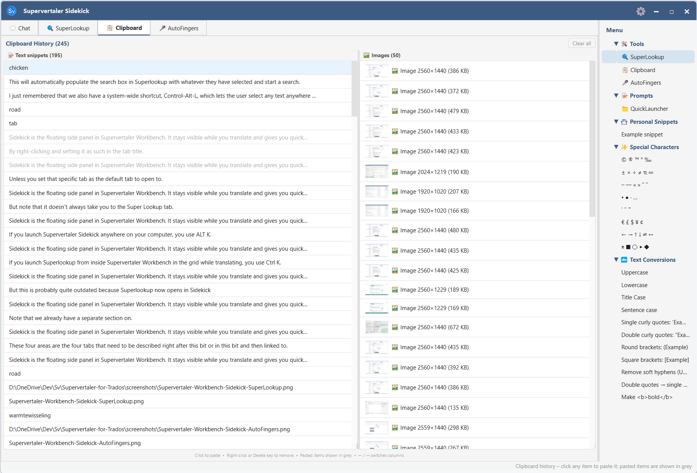


You are viewing help for 🖥️ **Supervertaler Workbench** – the free, open-source standalone translation app. Looking for help with the Trados Studio plugin? Visit 🧩 [Supervertaler for Trados help](https://supervertaler.gitbook.io/help/trados/).


The Clipboard Manager in Supervertaler Workbench captures everything you copy and keeps a persistent history that survives application restarts. Click any item to paste it; trigger a snippet or text conversion to paste the transformed result back to whichever app you came from.

| How | Shortcut |
| --- | --- |
| Open Clipboard Manager from any application | **Ctrl+Alt+C** (⌘⌥C on macOS) |
| Open Clipboard Manager tab manually | Click **📋 Clipboard Manager** in the Workbench tab bar |

When you summon the Clipboard Manager via **Ctrl+Alt+C** from another app (e.g. Trados), Workbench automatically sends Ctrl+C in the source app *before* opening the tab. So you don't need a separate "copy first" keystroke – the current selection lands at the top of the clipboard history the moment the tab opens.


The tab was renamed from "📋 Clipboard" to "📋 Clipboard Manager" in v1.10.47 to match what the widget actually does – it has been more than a clipboard history for several versions (Snippets, Text Conversions, QuickLauncher Prompts, plus the clipboard history columns).




***

## Three columns

The tab is split into three side-by-side panels:

* **📝 Text (left)** – plain text, rich text, and any other text copied from any application
* **🖼 Images (middle)** – raster images (screenshots, copied graphics, etc.)
* **📑 Menu (right)** – a tree of actions to apply to whatever's currently on the clipboard: Personal Snippets, Special Characters, Text Conversions, and your QuickLauncher Prompts

Each column has its own count in its header (e.g. *Text (37)*, *Images (8)*). A draggable splitter lets you resize the three panels.

The column header whose widget currently holds keyboard focus is **highlighted in blue with an underline**, so it's always obvious which column the arrow keys are steering.

***

## How clips are captured

The Clipboard Manager monitors the system clipboard in the background. Every time you copy something in any application – a word in Trados, a URL, a code snippet, a screenshot – it is added to the top of the relevant list automatically.

Duplicate copies of identical content are deduplicated (the existing item moves to the top instead of a new entry appearing).

**Capacity limits:**

| Kind | Maximum items |
| --- | --- |
| Text | 200 |
| Images | 50 |

When a list is full, the oldest item is removed to make room.

***

## Pasting a clip

Click any item in the Text or Images list to paste it. What happens:

1. The item is placed on the system clipboard.
2. Workbench is hidden to the system tray.
3. `Ctrl+V` is sent to whichever window was active before the Clipboard tab opened.

After pasting, the item is marked as used and appears greyed out. This makes it easy to track which clips you have already inserted in a session.


**Latest clip is highlighted on open.** Every time you switch to the Clipboard tab, the most recent text clip (top of the list) is selected automatically – press **Enter** to paste it without touching the mouse. If you'd rather paste an older clip, arrow up/down to it first.


## The Menu column

The third column gives you actions to apply to whatever's on the clipboard. Expand a category by clicking its arrow or pressing **Right** with the category focused.

### 🔄 Refresh button

The Menu column header has a small **🔄 Refresh** button on the right. Click it after editing any snippet `.md` file under `<user_data>/snippet_library/` (rename a snippet, change a snippet body, add a new snippet, delete one) or any QuickLauncher prompt `.md` file in the shared prompt library. Refresh rebuilds the entire Menu tree from disk in one click – before v1.10.47 there was no way to pick up external file edits short of restarting Workbench.

Refresh reloads three sources: the unified prompt library (via `UnifiedPromptLibrary.load_all_prompts()`), the snippet library (re-scans `<user_data>/snippet_library/` with a fresh `SnippetLibrary` instance), and the Text Conversions table (in-code, but rebuilt for symmetry).

### 📌 Personal Snippets

Your own text snippets (e.g. phone numbers, email signatures, boilerplate paragraphs). Snippets are loaded from `.md` files inside your user-data folder – see [Personal Snippets](../../trados/text-transforms.md) for the file format.

Activating a snippet (click or Enter) copies its body to the clipboard and pastes it into the source app via the same hide-and-paste flow used for clipboard clips.

### ✨ Special Characters

Quick-insert symbols, arrows, primes, dashes, quotes, currency signs, legal symbols, mathematical operators, and bullet characters. Activate one to paste the character into the source app.

### 🔁 Text Conversions

Transform whatever text is on the clipboard. The conversions are computed against the *current* clipboard contents – so the typical flow is: select text in another app → **Ctrl+Alt+C** to open the Clipboard Manager (current selection auto-copies) → navigate to a conversion → Enter to paste the converted text back over your selection.

#### The shipped defaults

Eleven conversions ship out of the box: **Uppercase**, **Lowercase**, **Title Case**, **Sentence case**, **Single curly quotes**, **Double curly quotes**, **Round brackets**, **Square brackets**, **Remove soft hyphens (U+00AD)**, **Double quotes → single quotes**, **Make `<b>bold</b>`**.

#### Adding your own

Since v1.10.48, every text conversion is a `.md` file under `<user_data>/text_conversion_library/`. The folder structure on disk is organisational – move files between folders to re-organise; the parent folder name becomes the conversion's category.

Drop a new `.md` file in the right folder, click **🔄 Refresh** on the Menu column, and the new conversion appears. Each file declares one conversion via YAML frontmatter at the top, with an optional human-readable notes section below:

```yaml
---
type: wrap
label: Mark as translator's comment TC: …
prefix: " TC: "
suffix: ""
---

Optional notes here. Workbench ignores everything below the closing ---.
```

The four supported `type` values cover most needs without arbitrary-code execution:

| `type` | What it does | Required fields | Optional fields |
| --- | --- | --- | --- |
| `case` | Change case of the whole text | `mode` (one of `upper`, `lower`, `title`, `sentence`, `swap`, `camel`, `snake`, `kebab`) | – |
| `wrap` | Glue a prefix and suffix around the text | `prefix`, `suffix` | – |
| `regex_replace` | Find/replace, literal or regex | `find`, `replace` | `regex` (default `true`), `case_sensitive` (default `true`) |
| `strip_chars` | Remove every occurrence of any listed character | `chars` | – |

Common optional metadata:

* `label` – the display label shown in the Menu. Defaults to the filename stem if omitted (useful when the label contains characters that can't be in filenames, like `:` or `"`).
* `category` – overrides the folder-derived category. Set to an empty string to surface the conversion at the top level.
* `enabled` – defaults to `true`. Set to `false` to hide without deleting (useful for project-specific conversions you might want back later).

#### Concrete examples

A wrap conversion for HTML emphasis:

```yaml
---
type: wrap
label: HTML <em>
prefix: <em>
suffix: </em>
---
```

A strip-chars conversion that removes several invisible characters in one go (uses YAML's `\u` escape inside double quotes):

```yaml
---
type: strip_chars
label: Strip invisible spaces (NBSP + figure space + narrow NBSP)
chars: "   "
---
```

A regex find/replace for em-dash-to-en-dash:

```yaml
---
type: regex_replace
label: "Em dash (—) → en dash (–)"
find: "—"
replace: "–"
regex: false
---
```

A regex find/replace using capture groups for UK → US "-our" → "-or" endings:

```yaml
---
type: regex_replace
label: "UK → US: drop the 'u' from -our endings"
find: "([Cc]olo|[Ff]avo|[Hh]ono|[Ll]abo|[Nn]eighbo|[Bb]ehavio|[Ff]lavo|[Oo]do|[Rr]umo)u(r)"
replace: "\\1\\2"
regex: true
---
```

(Note the doubled backslashes in `replace` – `\\1` in YAML is needed to produce `\1` in the actual regex replacement string.)

#### Things that DON'T work (and why)

The four `type` values are deliberately limited – no arbitrary Python execution from user-data files, no shell commands, no network calls. If you have a transformation that genuinely needs Python (multi-step pipelines that produce intermediate state, calls to an external library, etc.), open a GitHub issue describing the use case and we'll consider adding a `python_file` type with appropriate safeguards.

Broken conversions (invalid `type`, bad regex, missing required field) are silently skipped on load and logged to the Workbench log – the clipboard flow never breaks on a typo. Fix the file, click 🔄 Refresh, and the conversion comes back.

### 💬 QuickLauncher Prompts

Your custom AI prompts from the Prompt Manager, grouped by folder. Activating a prompt copies its body to the clipboard.

## Deleting clips

**Single item** – right-click any entry in the Text or Images list and choose **🗑 Delete**, or select it and press the **Delete** key.

**All clips** – click **Clear all** in the top-right corner of the Clipboard tab, or right-click any entry and choose **Clear all**. This removes the entire history from both the Text and Images lists and cannot be undone. (The Menu column is unaffected – it's not history.)

***

## Keyboard navigation

| Key | Action |
| --- | --- |
| **Up / Down** | Move through items in the focused column |
| **Right** | Move focus rightwards (Text → Images → Menu) |
| **Left** | Move focus leftwards (Menu → Images → Text) |
| **Right** on a Menu category | Expand the category |
| **Left** on an expanded Menu category | Collapse it |
| **Enter** | Paste the selected item / activate the selected action |
| **Delete** | Remove the selected clip from history (Text / Images lists only) |
| **Esc** | Hide Workbench to the system tray (when focus isn't in a text input) |

***

## Empty state

When a column contains no clips, a centred placeholder message is shown:

* Text column: *No text yet – copy any text to start*
* Image column: *No images yet – copy any image to start*

***

## Persistence

The full clip history is stored in your user data folder in a shared SQLite database. Items are available the next time you open Supervertaler Workbench.

***

## Related pages

* [Companion Tabs Overview](overview.md)
* [Voice](voice.md)
* [Trados-aware Chat](trados-aware-chat.md)
* [Keyboard Shortcuts](../settings/shortcuts.md)
